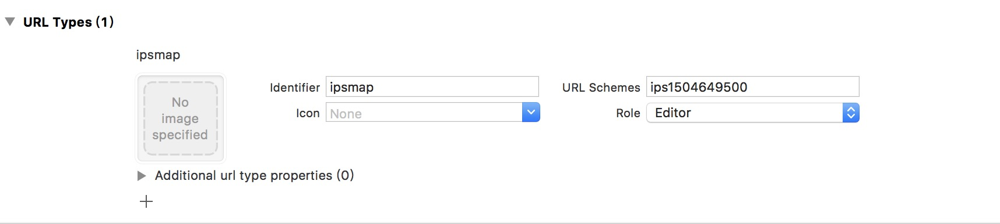

# IpsmapSDK-iOS

IpsmapSDK-iOS 是一套基于 iOS 8.0 及以上版本的室内地图应用程序开发接口，供开发者在自己的iOS应用中加入室内地图相关的功能，包括：地图显示（多楼层、多栋楼）、室内导航、模拟导航、语音播报等功能。

## 获取AppKey
请给dev@ipsmap.com邮件联系获取AppKey

## 使用CocoaPods部署
在Podfile中使用命令如下：
```bash
pod 'IpsmapSDK', '~> 1.0'
```
然后运行以下命令

```bash
$ pod install
```
### 注意
导入IpsmapSDK后需要
- Build Settings中将Enable Bitcode 改成 NO。
- 在Info.plist中添加授权申明
```bash
	<key>NSBluetoothPeripheralUsageDescription</key>
	<string>App需要您的同意,才能访问蓝牙</string>
	<key>NSContactsUsageDescription</key>
	<string>App需要您的同意,才能访问通讯录</string>
	<key>NSLocationWhenInUseUsageDescription</key>
	<string>App需要您的同意,才能在使用期间访问位置 </string>
	<key>NSMicrophoneUsageDescription</key>
	<string>App需要您的同意,才能访问麦克风</string>
  ```
  
## 使用说明  
### 显示室内地图
```objective-c
    IpsMapViewController *vc = [[IpsMapViewController alloc] initWithMapId:@"lGaWCUtqoj"];
    [self.navigationController pushViewController:vc animated:YES];
```
### 导航至具体地址
```objective-c
    IpsMapViewController *vc = [[IpsMapViewController alloc] initWithMapId:@"lGaWCUtqoj" targetName:@"成人中医(珠)" targetId:@"200191"];
    [self.navigationController pushViewController:vc animated:YES];
```
### 是否在地图范围内的接口
```objective-c
- (void)viewDidLoad {
    [super viewDidLoad];
    // Do any additional setup after loading the view.
    self.view.backgroundColor = [UIColor whiteColor];
    
    self.manger = [IpsmapLocationManger new];
    self.manger.locationTimeOut = 20;
    self.manger.delegate = self;
    
    [self.manger startLocationEngine:@"lGaWCUtqoj"];
}

- (void)ipsmapLocationManager:(IpsmapLocationManger *_Nullable)manager didUpdateLocation:(IpsLocation *_Nullable)location 
{
    if (location.inThisMap) {
        NSLog(@"在医院里面");
    }
}
```

### 位置共享功能

## 使用粘贴板实现（SDK1.1.6未启用该实现方案）

1、在 didFinishLaunchingWithOptions里面创建好window之后添加
```objective-c
    //检测位置共享口令是否存在
    [[NSNotificationCenter defaultCenter] addObserver:self selector:@selector(ipsReceiveShareInfo:) name:IpsReceiveShareInfoNotification object:nil];
    [[IpsmapServices sharedInstance] application:application didFinishLaunchingWithOptions:launchOptions];
```
2、在applicationWillEnterForeground里添加
```objective-c
 [[IpsmapServices sharedInstance] applicationWillEnterForeground:application];
```
3、通知响应处理
```objective-c
- (void)ipsReceiveShareInfo:(NSNotification *)noti {
    if (noti.object == nil || ![noti.object isKindOfClass:[UIView class]]) {
        return;
    }
    
    UIView *viewJoin = (UIView *)noti.object;
    //有分享口令
    dispatch_after(dispatch_time(DISPATCH_TIME_NOW, (int64_t)(1 * NSEC_PER_SEC)), dispatch_get_main_queue(), ^{
        [viewJoin performSelector:@selector(showInView:) withObject:[UIApplication sharedApplication].keyWindow];
    });
}
```

## 使用微信分享SDK实现（SDK1.1.6开始使用）
1、开发者可在自己的工程中接入微信SDK并完成register
```objective-c
   //例如在didFinishLaunchingWithOptions实现register
   [WXApi registerApp:wxAppID];
```
2、将获取到的scheme配置到自己的工程中

  
  
3、在每个IpsMapViewController创建完之后加上locationShareDelegate处理分享按钮点击的回调
```objective-c
     IpsMapViewController *vc = [[IpsMapViewController alloc] initWithMapId:@"lGaWCUtqoj"];
    vc.locationShareDelegate = [IpsLocationShareHandle sharedInstance];
    [self.navigationController pushViewController:vc animated:YES];
```
4、分享按钮点击的回调处理可以用demo中的IpsLocationShareHandle也可以自己写
	
